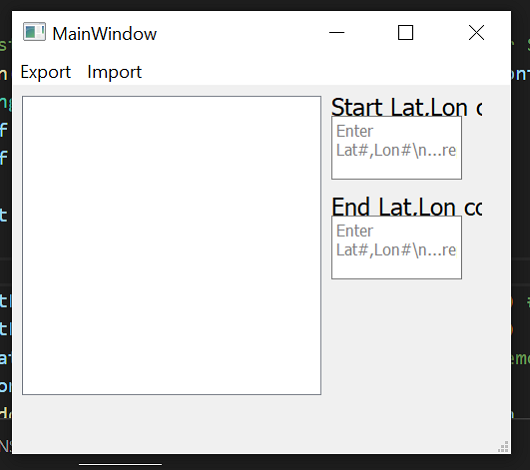
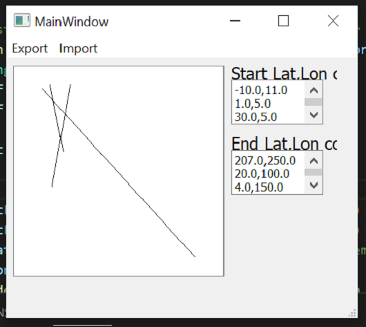
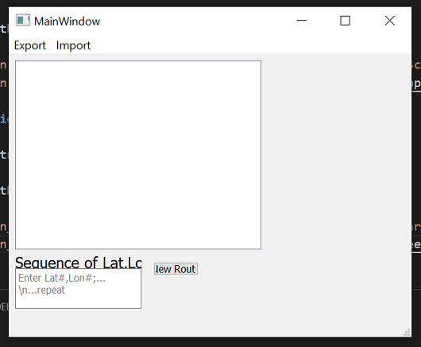
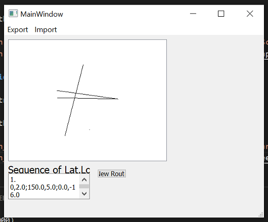

# test Qt Designer

## To run

### display_location test

Simple two text input of Lat,Lon numbers to draw on graphicsView and export data.
Currently only export and import csv.

1. Modify design in `display_location.ui`
2. Compile to `.py` file, run `sh convert_all.sh`
3. Modify extra code in `app.py`
4. Run `python app.py`

You will get something like...

### display_location_2 test

Attempt for non-straight route generator. Based on `display_location`.

You will get something like...

